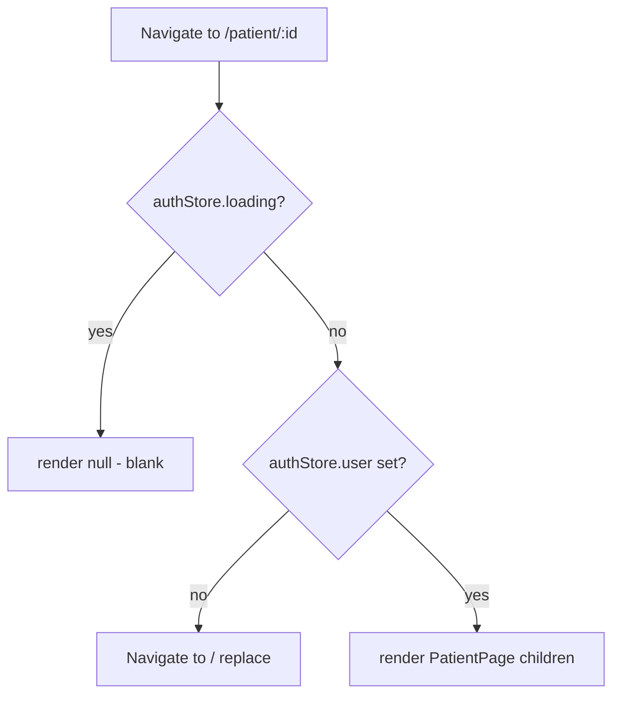

# QJump — Architecture Overview

Top-level map of the QJump SPA. Start here, then drill into the module docs listed below. This file covers app bootstrap, routing, the styling split, and the presentational component layer. It does **not** re-explain the data layer — see the linked doc.

## Documentation index

| Doc | Scope |
|---|---|
| `docs/ARCHITECTURE.md` (this file) | App bootstrap, routing, layout, styling systems, component-layer conventions. |
| `docs/STATE_AND_DATA_LAYER.md` | MobX stores + Supabase access, state schemas, write/read paths, DB tables. **Read before touching `src/stores/` or `src/data/`.** |

## Product context (one paragraph)

QJump lets a patient log in with HMO credentials, view their appointments, and request to **precede** (move earlier) or **postpone** (move later) an appointment. The backend anonymously matches patients wanting opposite swaps. The frontend in this repo handles auth, appointment display, and request submission/management; the matching engine is out of scope here.

---

## A. Architectural Intent & "Why"

**Pattern: client-only SPA with a thin presentational component tree over a MobX singleton data layer, served as a static bundle from GitHub Pages.**

- **No backend in this repo.** Supabase is the entire backend (auth + Postgres + row access). The app is a static build; there is no SSR despite `@supabase/ssr` being a listed dependency (currently unused by app code — treat as latent).
- **Two-tier component split by concern:**
  - *Marketing / app-chrome* components (`Hero`, `FeatureCard`, `Navbar`, `Footer`, `LoginForm`, homepage) — plain presentational React with hand-written CSS files.
  - *Patient-data* components (`PatientPage`, `RequestsPage`, `AppointmentCard`, `RequestCard`, modals) — Mantine components wrapped in MobX `observer`, reading singleton stores.
- **Routing is centralized** in `src/App.jsx`. A single `Layout` provides the Navbar/Footer shell via `<Outlet />`; `ProtectedRoute` gates the two patient routes.

**Why (do not refactor away):**
- Static-hosting constraint (GitHub Pages) is why `base`/`basename` are hardcoded to `/qjump/` and why there is no server code. Do not introduce SSR, API routes, or Node server assumptions.
- The marketing pages predate the app pages, which is why two styling systems coexist. This is intentional layering, not an accident to "unify."

> This is a Vite SPA, NOT Next.js. There is NO Tailwind. There is NO test runner. Do not assume any of those exist.

---

## B. The System Map (Bootstrap, Routing, Control Flow)

### Bootstrap chain

```
index.html (#root)
  └─ src/main.jsx        → React.StrictMode → <App/>
       └─ src/App.jsx    → <MantineProvider> → <Router basename="/qjump"> → <Routes>
            ├─ <Layout/> (Navbar + <Outlet/> + Footer)
            │    ├─ "/"                          → HomePage        (public)
            │    ├─ "/patient/:patientId"        → ProtectedRoute → PatientPage
            │    ├─ "/patient/:patientId/requests" → ProtectedRoute → RequestsPage
            │    ├─ "/how-it-works" | "/clinics" | "/resources" | "/support" (public)
            └─ "*"                               → NotFound        (outside Layout — no chrome)
```

### Route table

| Path | Component | Guard | Notes |
|---|---|---|---|
| `/` | `pages/HomePage.jsx` | public | Hero + `LoginForm` + feature cards |
| `/patient/:patientId` | `pages/PatientPage.jsx` | `ProtectedRoute` | fetches appointments on mount |
| `/patient/:patientId/requests` | `pages/RequestsPage.jsx` | `ProtectedRoute` | fetches postpone + precede requests |
| `/how-it-works`, `/clinics`, `/resources`, `/support` | static pages | public | Mantine-rendered marketing content |
| `*` | `pages/NotFound.jsx` | — | rendered **outside** `Layout` (no Navbar/Footer) |

### Auth gate flow



`authStore` is initialized once at import (`initializeAuth()` in its constructor): it reads `supabase.auth.getSession()` and subscribes to `onAuthStateChange`. `ProtectedRoute` (an `observer`) reacts to `authStore.user`.

### Component layer responsibilities

| Path | Type | Role |
|---|---|---|
| `src/components/Layout.jsx` | function | App shell: `<Navbar/> <Outlet/> <Footer/>` |
| `src/components/Navbar.jsx` | function | Nav + logout. **Holds its own auth/session state** (see quirk in §C). |
| `src/components/Footer.jsx` | function | Static footer |
| `src/components/Hero.jsx`, `FeatureCard.jsx` | function | Marketing, plain CSS |
| `src/components/LoginForm.jsx` | `observer` fn | Binds inputs to `authStore`, calls `authStore.login()`, navigates on success |
| `src/components/AppointmentCard.jsx` | `observer` **class** | Renders one appointment; opens precede/postpone modals via `appointmentStore` |
| `src/components/RequestCard.jsx` | `observer` **class** | Renders one request; deletes via the correct requests store based on `type` prop |
| `src/components/PostponeModal.jsx`, `PrecedeModal.jsx` | `observer` fn | Local form state + validation, then call `appointmentStore.submit*Request` |
| `src/components/ProtectedRoute.jsx` | `observer` fn | Route guard on `authStore.user` |

### Client-side persistence (localStorage)

| Key | Written by | Meaning |
|---|---|---|
| `qjump_patientId` | `LoginForm`, `Navbar` | last resolved patient id (used for nav "Back to Dashboard") |
| `sb-<ref>-auth-token` | supabase-js (automatic) | persisted session; `Navbar.hasPersistedSession()` sniffs this key |

---

## C. Absolute Constraints & "NEVER" Rules

App-wide rules. Data-layer rules (Supabase access, `runInAction`, etc.) live in `docs/STATE_AND_DATA_LAYER.md` — both apply.

- **NEVER change `base` in `vite.config.js` or `basename` in `src/App.jsx` independently.** Both are `/qjump/` for GitHub Pages. They must stay in sync or all routes/asset paths 404 in production.
- **NEVER introduce Tailwind, CSS-in-JS, or a new styling system.** Two systems already exist by design: (1) Mantine props/components for patient-facing app UI, (2) co-located `*.css` files with plain class names for marketing/chrome (`Navbar.css`, `Footer.css`, `Hero.css`, `FeatureCard.css`, `LoginForm.css`, `HomePage.css`). Match whichever the file you're editing already uses.
- **NEVER assume a test framework.** There is none. `package.json` scripts are only `dev`, `build`, `preview`, `lint`, `deploy`. Do not add `import ... from 'vitest'`/'jest' unless explicitly setting up testing.
- **NEVER add a data-reading component without wrapping it in `observer(...)`.** Un-observed reads of store observables will not re-render.
- **NEVER render `NotFound` inside `Layout`,** and never move authenticated pages outside `ProtectedRoute`. The route nesting in `App.jsx` is deliberate.
- **NEVER add server-side / Node runtime code.** Static build only. `@supabase/ssr` is present but unused; do not wire it up assuming a server exists.
- **KNOWN VIOLATION — do not copy it:** `Navbar.jsx` imports `supabase` directly, runs its **own** `onAuthStateChange`/`getSession`, keeps auth in local `useState`, and mutates `appointmentStore.patient_name = ''` directly (outside `runInAction`). This duplicates `authStore` and violates the data-layer boundary. It is legacy drift. For **new** code, gate on `authStore.user` and go through store actions — do not add more direct `supabase` usage in components.

---

## D. How to Add a New Feature (Step-by-Step Templates)

### D.1 Add a new public marketing page

1. Create `src/pages/YourPage.jsx`. For marketing content, prefer Mantine primitives (`Container`, `Title`, `Text`, `Stack`, `Paper`) as `HowItWorks.jsx` does; use a co-located `.css` only if you need custom layout.
2. Register a `<Route path="/your-page" element={<YourPage />} />` **inside** the `<Route element={<Layout />}>` block in `src/App.jsx` so it gets Navbar/Footer.
3. Add a `<Link to="/your-page">` to `src/components/Navbar.jsx` nav-links (and `onClick={() => setIsMenuOpen(false)}` to close the mobile menu).

### D.2 Add a new protected patient route

1. Create the page, fetch data in `useEffect(..., [patientId])` via the relevant store (create one per `docs/STATE_AND_DATA_LAYER.md` §D.1 if needed), and `export default observer(Page)`.
2. In `src/App.jsx`, wrap it: `<Route path="/patient/:patientId/thing" element={<ProtectedRoute><ThingPage/></ProtectedRoute>} />`.
3. If it needs a nav entry, add a conditional `<Link>` in `Navbar.jsx` following the existing `isPatientPage && isAuthenticated && patientId` pattern.

### D.3 Add a new card/action on the patient dashboard

1. Presentational card → follow `AppointmentCard.jsx`/`RequestCard.jsx`: Mantine `Card` + `Flex`, buttons call store actions, wrap the export in `observer`.
2. Any button that mutates data calls a **store action** (never Supabase directly). For a modal-driven action, follow the modal pattern in `docs/STATE_AND_DATA_LAYER.md` §D.2.

---

## E. Common Failure Modes & Debugging Runbook

- **All routes 404 after deploy.** `base`/`basename` mismatch, or GitHub Pages serving from the wrong path. Both must be `/qjump/`. Deploy with `npm run deploy` (runs `predeploy` → `build`, then `gh-pages -d dist`).
- **Navbar shows logged-in state but pages redirect to `/` (or vice-versa).** Two independent auth sources are in play: `Navbar`'s local `useState`/localStorage sniff vs. `authStore.user`. They can disagree during session restore. Treat `authStore.user` as canonical; the Navbar mismatch is the known drift in §C.
- **`patient_name` header doesn't clear after logout.** `Navbar.handleLogout` sets `appointmentStore.patient_name = ''` directly. If MobX strict-mode warns, that is why — it should go through an action.
- **Blank screen on a `/patient/...` route.** `ProtectedRoute` renders `null` while `authStore.loading`. If it never resolves, `initializeAuth()` likely threw — check the console and Supabase env vars.
- **Env vars undefined at runtime.** They must be prefixed `VITE_` and present at **build** time (Vite inlines them). Copy `.env.example` → `.env` with `VITE_SUPABASE_URL` and `VITE_SUPABASE_PUBLISHABLE_KEY`.
- **Date renders wrong / `NaN`.** Cards parse `YYYY-MM-DD` by string-splitting (`AppointmentCard`, `RequestCard.formatDate`), not `Date` parsing. Malformed/short dates break the split. Keep DB dates ISO `YYYY-MM-DD`.

### Verifying changes

- Lint: `npm run lint` (oxlint, config `.oxlintrc.json`).
- Dev server: `npm run dev` (needs `.env`).
- Production build: `npm run build` then `npm run preview` to sanity-check the `/qjump/`-based bundle.
- Deploy: `npm run deploy` (GitHub Pages via `gh-pages`).
- No automated tests exist — verify manually across: `/` (login), `/patient/:id` (appointments + open both modals + submit), `/patient/:id/requests` (list + delete), and a marketing page (chrome/nav). Confirm DB rows in the Supabase dashboard.
