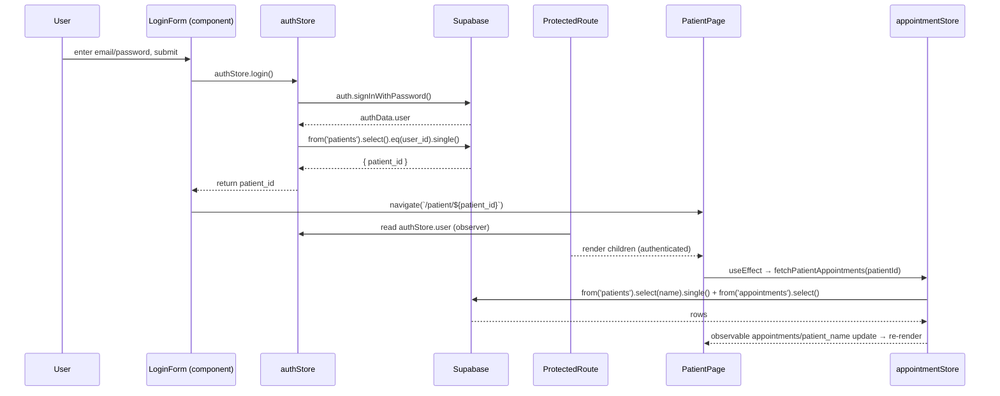
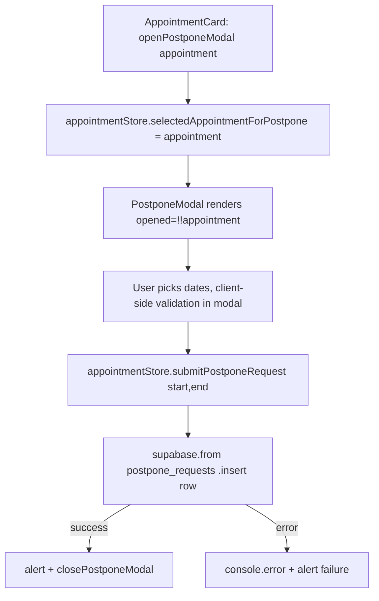

# State & Data Layer

Authoritative reference for how QJump reads/writes data and manages client state. Read this before touching anything under `src/stores/` or `src/data/`.

---

## A. Architectural Intent & "Why"

**Pattern: MobX singleton stores as the single data-access boundary.**

- Every store is a class instantiated **once** at module load and exported as a lowercase singleton (`export const appointmentStore = new AppointmentStore()`). There is no store provider, no React Context, no dependency injection. Components import the singleton directly.
- Each store owns **observable state** + **async actions**. Supabase is imported **only** inside stores. Components never see `supabase`.
- Reactivity is achieved by wrapping every consuming component in `observer(...)` from `mobx-react-lite` (pages/modals) or `mobx-react` (`ProtectedRoute`). Reading `store.someObservable` inside an `observer` component subscribes that component to re-render on change.
- All observable mutations inside `async` functions are wrapped in `runInAction(() => { ... })`. This is required because MobX strict mode (enabled by `makeAutoObservable`) forbids mutating observables outside an action, and `await` boundaries drop you out of the original action context.

**Why this pattern (do not refactor away):**
- The app is small and single-tenant-per-session (one logged-in patient). Global singletons are intentionally simpler than Redux/Zustand slices or per-component `useState` + fetch. There is deliberately no server-state cache library (React Query/SWR) — freshness is handled by re-fetching in `useEffect` on route param change.
- Centralizing Supabase access in stores keeps the SQL surface auditable in ~5 files and keeps components declarative/presentational.

> This is NOT Redux, NOT Zustand, NOT React Query, and NOT Context. Do not "modernize" it into one of those without an explicit instruction. Match the existing singleton-store idiom.

---

## B. The System Map (Data & Control Flow)

### File responsibilities

| Path | Responsibility |
|---|---|
| `src/data/supabaseClient.js` | Creates and exports the single `supabase` client from `VITE_SUPABASE_URL` + `VITE_SUPABASE_PUBLISHABLE_KEY`. The **only** place `createClient` is called. |
| `src/stores/AuthStore.js` | Session bootstrap, `onAuthStateChange` listener, `login()` (password auth → resolves `patient_id`), holds `user`. |
| `src/stores/AppointmentStore.js` | Fetches a patient's appointments + display name; owns the two modal-selection slots; submits postpone/precede requests (writes). |
| `src/stores/PostponeRequestsStore.js` | Fetch + delete of `postpone_requests` rows for a patient. |
| `src/stores/PrecedeRequestsStore.js` | Fetch + delete of `precede_requests` rows for a patient. (Near-identical twin of the postpone store.) |
| `src/components/ProtectedRoute.jsx` | Gates routes on `authStore.user`; returns `null` while `authStore.loading`. |

### Control flow — login → protected page → request



### Control flow — submit a postpone request (write path)



### State schema (observables per store)

```ts
// AuthStore
interface AuthState {
  email: string;            // controlled input mirror
  password: string;         // controlled input mirror
  loading: boolean;         // true during login()/initializeAuth()
  errorMessage: string;     // last auth error, shown in LoginForm
  user: import('@supabase/supabase-js').User | null; // source of truth for auth
}

// AppointmentStore
interface AppointmentState {
  appointments: Appointment[];               // rows from `appointments`
  loading: boolean;
  patient_name: string;                      // "First Last" for header (typed [] initially — see Failure Modes)
  selectedAppointmentForPostpone: Appointment | null; // drives PostponeModal open/close
  selectedAppointmentForPrecede: Appointment | null;  // drives PrecedeModal open/close
}

// PostponeRequestsStore / PrecedeRequestsStore (identical shape)
interface RequestsState {
  requests: RescheduleRequest[]; // rows from postpone_requests / precede_requests
  loading: boolean;
}
```

### Mutating actions & where side effects are allowed

| Store | Action | Side effect (I/O) |
|---|---|---|
| `authStore` | `setEmail`, `setPassword` | none (sync) |
| `authStore` | `initializeAuth()` | `supabase.auth.getSession()`, `supabase.auth.onAuthStateChange()` |
| `authStore` | `login()` | `signInWithPassword` + `patients` select; returns `patient_id \| null` |
| `appointmentStore` | `openPostponeModal/closePostponeModal/openPrecedeModal/closePrecedeModal` | none (sync selection toggles) |
| `appointmentStore` | `fetchPatientAppointments(patient_id)` | `patients` select + `appointments` select |
| `appointmentStore` | `submitPostponeRequest(start,end)` | `postpone_requests` insert + `alert()` |
| `appointmentStore` | `submitPrecedeRequest(start,end)` | `precede_requests` insert + `alert()` |
| `postponeRequestsStore` | `fetchPatientRequests(id)` / `deletePatientRequest(request_id)` | `postpone_requests` select / delete |
| `precedeRequestsStore` | `fetchPatientRequests(id)` / `deletePatientRequest(request_id)` | `precede_requests` select / delete |

**Side effects (network, `alert`, `console`) are permitted ONLY inside store async actions.** Components and modals must never call `supabase` directly.

### Inferred Supabase schema (source of truth is the DB, not this file)

Columns below are inferred from `.select()/.insert()/.eq()` usage — verify against the Supabase dashboard before relying on them.

```
patients            : patient_id (int, PK), user_id (uuid → auth.users), first_name, last_name
appointments        : appointment_id (PK), patient_id (int FK), user_id (uuid), date, location, ...
postpone_requests   : request_id (PK), appointment_id, patient_id (int), user_id, start_date, end_date, locations
precede_requests    : request_id (PK), appointment_id, patient_id (int), user_id, start_date, end_date, locations
```

---

## C. Absolute Constraints & "NEVER" Rules

- **NEVER import `supabase` (`src/data/supabaseClient.js`) outside `src/stores/`.** All DB/auth access goes through a store action. Components/pages/modals must not query Supabase directly.
- **NEVER mutate an observable after an `await` without `runInAction(() => { ... })`.** `makeAutoObservable` runs in strict mode; a bare mutation post-`await` throws/warns and breaks reactivity.
- **NEVER read store observables in a component that is not wrapped in `observer(...)`.** Without `observer`, the component will not re-render on store changes. Pages/modals use `mobx-react-lite`; `ProtectedRoute` uses `mobx-react` — keep those imports as-is.
- **NEVER create a second Supabase client** (`createClient`). Reuse the exported `supabase` singleton. Multiple clients break the shared auth session.
- **NEVER instantiate a store inside a component or with `new`.** Import the existing lowercase singleton (`appointmentStore`, `authStore`, etc.). One instance per store, app-wide.
- **NEVER pass a raw string `patient_id` into an `.eq('patient_id', ...)` filter without `parseInt(patient_id, 10)`.** Route params arrive as strings; the column is integer. Every existing fetch parses first — match it.
- **NEVER derive auth state from anything but `authStore.user`.** `ProtectedRoute` gates on `!!authStore.user` and returns `null` while `authStore.loading`. Do not add parallel auth flags.
- **NEVER add inline `style={{...}}` for layout/spacing/color.** Use Mantine props/components (`Paper`, `Stack`, `c="blue.9"`, `py="xl"`). Inline style is used in this repo only for one-off `textAlign` — do not expand that.
- **NEVER hardcode Supabase URL/key.** They come from `import.meta.env.VITE_SUPABASE_URL` / `VITE_SUPABASE_PUBLISHABLE_KEY` (see `.env.example`). Prefix must stay `VITE_` or Vite will not expose it to the client.
- **NEVER couple `location` (singular, on `appointments`) with `locations` (plural, on request tables) blindly** — they are different columns. The insert path deliberately maps `appointment.location → locations`. Preserve that mapping.

---

## D. How to Add a New Feature (Step-by-Step Templates)

### D.1 Add a new patient-scoped read collection (e.g., "cancellation_requests")

1. Create `src/stores/CancellationRequestsStore.js`. Copy `src/stores/PostponeRequestsStore.js` verbatim and rename the class + singleton + target table (`cancellation_requests`).
2. Ensure the async fetch: sets `loading=true` in `runInAction`, does `parseInt(patient_id, 10)`, `.select('*').eq('patient_id', parsedPatientId)`, assigns `this.requests = data || []` in `runInAction`, and resets `loading` in `finally`.
3. In the consuming page, `import { cancellationRequestsStore }`, call `store.fetchPatientRequests(patientId)` inside `useEffect(..., [patientId])`.
4. Wrap the page in `export default observer(Page)` and read `store.requests` / `store.loading` in JSX.

### D.2 Add a new write action to `AppointmentStore` (e.g., "cancel appointment")

1. Add an observable selection slot if it needs a modal: `selectedAppointmentForCancel = null;` plus `openCancelModal`/`closeCancelModal` sync methods.
2. Add `async submitCancelRequest(...args)`. Follow the existing `submitPostponeRequest` shape exactly:
   - guard on the selected appointment, `runInAction` → `loading=true`;
   - `await supabase.from('<table>').insert([{ appointment_id, patient_id, user_id, ...payload }])`;
   - on success `alert(...)` + close modal in `runInAction`; on error `console.error` + `alert`; always reset `loading` in `finally`.
3. Add a `CancelModal.jsx` mirroring `src/components/PostponeModal.jsx`: `opened={!!appointment}`, local `useState` for form fields, client-side validation in a `handleValidation`, then call the store action. Wrap in `observer`.
4. Mount the modal once in the relevant page (like `<PostponeModal />` in `PatientPage.jsx`).

### D.3 Add a new column to an existing request insert

1. Add the field to the DB table in Supabase first.
2. Add it to the `.insert([{ ... }])` object in the store action.
3. If user-supplied, add the input to the corresponding modal and thread it through the action signature. Validate in the modal before calling the store.

---

## E. Common Failure Modes & Debugging Runbook

- **Component doesn't re-render after a fetch.** It is missing `observer(...)`, or it destructured the observable into a local variable before render (breaks tracking). Read `store.x` directly in JSX and wrap the component.
- **MobX warning: "Since strict-mode is enabled, changing (observed) observable values without using an action is not allowed."** A mutation happened after `await` outside `runInAction`. Wrap it.
- **`.eq('patient_id', ...)` returns 0 rows for a valid patient.** The route param is a string but the column is int. Confirm `parseInt(patient_id, 10)` is applied.
- **`patient_name` briefly renders as `[]` / empty.** Its initial value is typed as `[]` (should be `""`) — a known inconsistency in `AppointmentStore.js`. It resolves to a string after fetch. Prefer initializing to `""` if you touch it.
- **Postpone/precede stores drift apart.** `PostponeRequestsStore` and `PrecedeRequestsStore` are copy-paste twins differing only by table name and log strings. If you fix a bug in one, apply it to the other (or extract a shared base — but only with explicit sign-off, per Section A).
- **Errors are swallowed on read paths.** `fetchPatient*` catches to `console.error` and leaves stale/empty state with no user-facing error. When debugging "nothing loads," check the console before assuming an empty DB.
- **Write feedback is `window.alert()`.** `submit*Request` uses blocking `alert()` for success/failure — expected current behavior, not a bug.
- **Auth session not restored on refresh.** `ProtectedRoute` returns `null` while `authStore.loading`; if a page flashes to `/`, verify `initializeAuth()` completed and `onAuthStateChange` fired.

### Verifying changes

- Lint: `npm run lint` (oxlint; config in `.oxlintrc.json`).
- Run locally: `npm run dev` (Vite). Requires `.env` with `VITE_SUPABASE_URL` and `VITE_SUPABASE_PUBLISHABLE_KEY` (copy `.env.example`).
- Build check: `npm run build`.
- **There is no unit/e2e test suite in this repo.** Verify store changes manually: log in, hit `/patient/:patientId` (read path) and `/patient/:patientId/requests` (requests read/delete), and exercise a postpone/precede submit (write path). Confirm rows in the Supabase dashboard.
